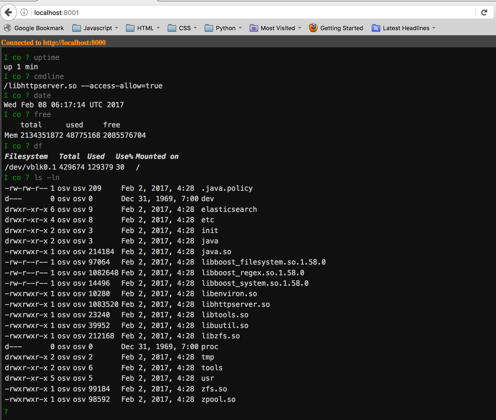

# osv-html5-terminal
HTML5 command line terminal for OSv.  
The command line handling logic converted to Typescript from JS project https://github.com/mrchimp/cmd

### Quick start
##### Configure
* npm install

##### Build
* npm run build
  * The dist directory will contain all app artifacts.

##### Run locally and open the app in the default browser
* npm run server
  * Expects OSv httpserver running and exposed on port 8000

### Motivation
OSv comes with an httpserver module that serves REST API. It also comes with lua-based cli 
module that provides shell-like (or ssh-like) command line interface to running OSv instance.  

So instead of command line program this HTML5 app provides similar functionality but instead 
in a browser so it can be executed anywhere without having to build cli executable for target OS.

Verified to work in Firefox, Safari and with some limitations in Chrome.

### Functionality
##### Commands
* cat	
* cls
* cd
* cmdline	
* connect
* date	
* df		
* dmesg	
* free	
* help
* ls		
* mkdir	
* poweroff	
* pwd	
* reboot
* rm		
* top	
* uptime

All commands support --help option.

### Screenshot

### Improvements
- Functionality
    - Add commands
        - tree
        - mv
        - cp
        - find
        - ZFS
            - mount
            - unmount
            - etc
    - ability to edit file (cat and then put)
    - path completion when ls, cd, etc
    - HTTPS with client certificate
- Refactoring
    - extract OSv API abstraction
    - use promises (JQuery)
    - error handling
    - HTML escaping
    - typescript
        - introduce interfaces for some of the responses from Osv
